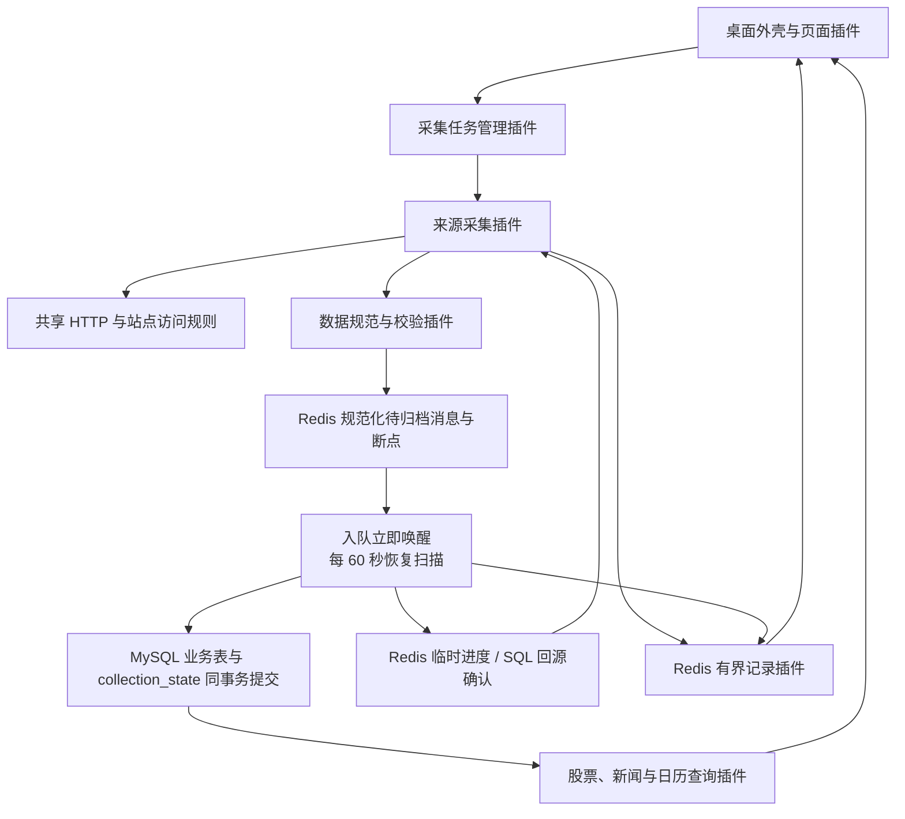

# Empire 架构设计

本文描述当前实现和已确认的存储简化方案。当前业务为新浪沪深北股票列表、新浪 7×24 财经新闻和巨潮 A 股交易日历；公告、历史行情、选股和回测尚未接入。

## 1. 需求基线与设计假设

| 项目 | 约束 |
| --- | --- |
| 使用方式 | 个人使用，本地 Windows，Python / PySide6 桌面 |
| 研究范围 | A 股投资研究与决策辅助；暂不接入券商和实盘自动下单 |
| 插件 | 全部业务能力由内部插件提供，运行时可启停，不开放第三方加载 |
| 发布方式 | 整个应用统一发布；代码更新后重启，运行时启停不等于代码热更新 |
| 数据服务 | 直接连接本机或已有 Redis / MySQL，不使用 Docker Desktop 或 WSL2 |
| 数据库变更 | 应用升级不自动迁移、重建或搬运数据；按实际需求显式执行针对性 SQL并记录变更 |
| 业务数据路径 | 来源响应经过校验和规范化后先入 Redis，立即唤醒归档器并每 60 秒恢复扫描；MySQL 提交后删除对应队列消息 |
| 数据保留 | MySQL 保存 stock、finance_news、trade_calendar 三类业务表及每项目一条 collection_state；不保留成功请求原文及历史完整股票快照 |
| 故障记录 | 采集记录每项目 100 条、归档记录每项目 100 条、错误记录每项目 300 条，都只留 Redis，不归档 |
| 频率管理 | 执行计划与 HTTP 请求间隔分开；同域名组共享间隔、并发及服务器冷却 |

应用关闭后停止采集。Windows 当前用户只允许一个 Empire 实例，不因使用不同配置文件绕开单实例保护。按用户最新要求，Redis 关闭 AOF 和自动快照，断点与运行状态只留内存，任务及网站频控配置保存于 MySQL app_setting；Redis 服务或电脑重启会丢失未归档数据及控制状态。只重启应用可续跑。服务全局配置只在明确维护时修改，应用启动不修改。

## 2. 总体结构

采用单体桌面应用、插件内核和持久化数据管道，不引入微服务、插件沙箱或外部调度平台。

界面只通过能力接口查询和操作后台，SQL、网络和 Redis 操作不在 Qt 主线程执行。异步后台负责采集、计划和归档；MySQL 按浏览与持久化职责隔离执行器及连接池。

业务浏览和采集完成确认是两个正式能力。`stocks.query`、`news.query`、`calendar.query` 只依赖 MySQL，所以 Redis 不可用时仍可读取已归档数据；`archive.confirmation` 依赖 Redis 和 MySQL，由采集器等待队列提交时使用。Redis 故障会阻塞确认、采集、归档及临时核验，但不会把 MySQL 中已经提交的数据隐藏，也不会用 SQL publication 冒充 Redis 的“最近成功核验”。恢复 Redis 后只需恢复依赖链，无需重启三个查询插件。

### 数据库执行资源隔离

股票、新闻和日历页面使用 `mysql.read` 与 `read_engine`：2 个工作线程、2 个连接，最多另排队 16 项。归档事务、配置读写、采集进度回源和日历补齐计划使用 `mysql.control` 与 `engine`：1 个工作线程、1 个独立连接，最多另排队 32 项。`archive` 通过 control 执行完整事务；不在页面通道执行写入，也不把浏览查询放回持久化通道。显式维护入口不变。

准入在向线程池提交之前限制；满队明确返回“尚未执行”，归档消息继续保留，配置不报保存成功。排队阶段取消则不执行；开始执行后，包括重复取消在内，都等待线程真实完成后释放额度，再向调用方传播取消，不把取消当作回滚证明。应用正常退出拒绝新请求，等待已接收操作结束再关闭连接池和线程；启动验证失败也回收资源。运行状态页展示两通道执行、等待、容量和满队拒绝次数。

这隔离的是应用排队和连接资源，不隔离同一 MySQL 服务的 CPU、磁盘或行锁；长事务仍可能延迟同通道的配置保存。新闻列表另使用已有 `(source, published_at, news_id)` 索引做稳定游标翻页，后页不使用 OFFSET 或重复 COUNT；增加线程不替代索引与查询设计。

## 3. 插件内核与能力边界

内核只处理插件清单、依赖顺序、能力注册、状态和任务资源回收，不解释股票字段或网站规则。插件声明 `requires` / `provides`，由内部白名单注册；不存在动态扫描第三方目录。

| 插件能力 | 职责 |
| --- | --- |
| `redis.store` / `mysql.store` | 连接、能力检查与受控存储操作 |
| `http.fetch` | 统一流式读取、响应字节/文件配额、重试、重定向、域名组许可及冷却 |
| `ingest.publish` | 规范化消息与游标的原子入队、容量背压 |
| `archive.worker` | 恢复队列，验证完整批次，提交 MySQL 后确认和删除 |
| `archive.confirmation` | 供采集器读取临时归档进度；缓存缺失或不可信时回源 SQL |
| 数据规范插件 | 规范字段、身份校验与业务持久化映射 |
| 来源采集插件 | 解析来源、分页、边界校验、断点恢复；不直接写 MySQL |
| `collection.control` | 任务计划、参数、执行互斥、暂停和采集记录 |
| `collection.records` | 独立归档记录与错误样本，按项目限量保存及精确删除 |
| `stocks.query` / `news.query` / `calendar.query` | 仅从 MySQL 读取已归档业务数据；不依赖 Redis |
| `ui.pages.<domain>` | 按统一契约贡献页面和导航分组 |

插件启动只提供能力；任务执行由统一管理器决定。停止有依赖的插件时显式处理依赖关系，并等待其拥有的协程和连接退出。UI 插件通过 `PageContribution` 声明页面，不把导航或业务按钮写死在内核。

内置数据类型通过白名单式 `DatasetContribution` 注册数据集、摘要命名空间、版本契约、聚合/增量模式、项目身份、完成判定和聚合运行标记；统一归档器只按贡献声明调度，不维护 job→project 或数据集分发表。内置任务通过 `TaskContribution` 注册展示和采集能力。控制器不再静态依赖全部采集器：停用一个采集器只令对应任务显示不可用，其他任务、设置和运行记录仍可使用；重新启用后恢复该任务。这里没有包扫描或第三方代码自动加载。

来源采集器不继承共享业务基类。`contracts.collector` 只声明入队、归档确认、错误记录、checkpoint 及运行结果的 Protocol/TypedDict；`collectors.support` 只组合可恢复容量等待、单一发布重试、归档 complete/invalid 等待和诊断写入失败保护。股票整批完整性、新闻 ID 覆盖和日历月份计划仍由各自插件拥有。公共契约与辅助模块进入严格 mypy 检查；新增采集器可按同一协议组合，不复制生命周期模板，也不能通过拼错关键字建立隐式新路径。

`PluginContext.spawn(..., critical=True)` 声明关键常驻循环，当前用于归档、调度、代理发现和 Redis 健康监测。正常停用先标记停止意图再回收任务；运行中意外完成、取消或异常退出将所属插件置为 FAILED，保留资源所有权直到显式正常停用。内核不自动重启或重放写入。普通一次性任务完成不改变服务健康；服务自报异常、健康查询异常与依赖异常投影为 DEGRADED，恢复后重新计算。后台错误摘要每插件最多 100 条、每条 2048 UTF-8 字节，存入和日志输出前通过统一脱敏，不保存原始异常到错误集合。

## 4. 股票数据与存储

股票业务表 `stock` 主键为 `(source, unified_code)`，只存股票属性。统一 `collection_state` 主键为 `(namespace, project_id)`，保存项目最近 SQL 确认进度；股票 publication 记录最后实际变化批次，日历 observed 记录每月 SQL 确认观测上界。业务修改和状态写入同事务完成。Redis 可信摘要命中时整个 SQL 阶段均跳过。

股票批次身份仅位于统一状态 payload，不再重复放在股票行中。六位代码按字符串保存；统一代码如 `000001.SZ`、`600519.SH`、`920000.BJ`，市场由来源标识确定。

新批次的开始、规范化股票分页和完成证据暂留 Redis 同一入队 Stream，不另建重复暂存表。归档器取得完整证据后，在一个 MySQL 事务内替换对应来源和节点的当前列表。事务失败或批次不完整时旧列表继续可见。成功请求的完整 HTTP 原文只用于当前解析，不进入 Redis 业务队列或 MySQL。

股票列表是当前基础数据，不是历史任意时点股票池。未来历史行情等数据集应单独确定保留规则，不能直接套用当前列表的覆盖规则。

## 5. 三类记录与错误处理

| 数据 | 所在位置 | 上限与规则 |
| --- | --- | --- |
| 采集记录 | Redis 控制数据 | 每个项目最近 100 条，记录执行状态、时间与结果摘要 |
| 归档记录 | Redis 独立 LIST | 每个项目最近 100 条，记录批次归档结果 |
| 错误记录 | Redis 独立 LIST | 每个项目最近 300 条；错误原文样本每条最多 64 KiB |

三类记录都不进入业务归档队列，不写入 MySQL。错误记录包括发生时间、阶段、原因、请求地址、状态码、元数据及最多 64 KiB 脱敏样本。完整读取的原文保留完整长度和摘要；下载提前终止则 `body_complete=false`，`original_bytes` / `original_sha256` 未知，只记录 `observed_bytes` 和脱敏样本 `sample_sha256`，不冒充完整证据。公共脱敏器统一处理 URL、文本与结构化值；快照先脱敏再序列化，不对完整 JSON 替换密码而破坏其结构。

错误页通过同一记录服务分页读取摘要，每页 50 条；Redis Lua 在服务端从唯一记录 LIST 提取 `id/project/time/stage/error/status`，不把正文、URL 和元数据随列表返回。只有选中一条时才按项目与 ID 读取完整详情。每次新增、同 ID 替换或实际清理同步推进轻量修订号，静止轮询命中相同修订时不返回列表；修订号只是查询缓存失效信号，不是另一份错误记录或持久审计数据。

错误不会因为打开页面或后续采集成功而自动清除。先修复并验证问题，再在运行记录的错误页选择具体记录、确认已完成修复验证，调用 `clear_errors(project_id, record_ids)`。删除范围为确定的项目和记录 ID，期间产生的新错误继续保留；禁止按整个项目清空代替精确清除。容量超过 300 条时按有界保留规则淘汰最旧项。

## 6. 数据管道归档与断点恢复

归档统一采用业务内容摘要缓存。可信命中完全免 MySQL 访问；缺失、不一致或损坏回 SQL。数据插件声明版本维数、日期格式、时区与股票批次格式，统一层解析后比较，并核实有效期索引。观测超前本机 5 分钟、新闻修订超前观测 5 分钟只使该证明不能走缓存快径，业务仍可回 SQL 确认。SQL 成功但版本不可缓存时精确失效该键旧证明，不阻塞成功清队。股票 committed 是进度显示，不是归档清队权威；旧批次以可信摘要或 SQL 核对。插入/更新提交、确认相同或确认过时均删除对应消息；SQL 失败保留。摘要默认每数据集/来源 10000 条、7 天有效期。完整规则见 [统一归档去重](archive-deduplication.md)。

1. 来源插件取得响应并完成字段、顺序和页边界校验，生成规范化消息。
2. Redis Lua 以游标版本 CAS 校验并一次提交整页消息与下一页游标，先入队后推进断点，不产生漏页窗口。
3. 入队立即唤醒归档器检查待处理数据；每 60 秒恢复扫描，启动时先恢复遗留工作。未取得完成证据的整批数据仍留 Redis，不发布不完整列表。

   归档使用有界 Stream-ID 索引、可续进扫描游标及项目轮转。每轮默认扫描最多 500 条 / 8 MiB，扫描窗口间检查 50 毫秒预算；随后最多处理 32 个业务单元，并在单元间检查 50 毫秒预算。新闻一页、日历一月、股票完整列表各为一个业务单元，股票事务不拆分。尚有工作立即继续下一轮，60 秒只用于恢复检查；未完成股票不反复读取正文。索引默认最多 100000 个消息 ID，只是可丢弃的调度状态，重启由原 Stream 重建，不增加业务表、Redis 第二份业务队列或兼容消费路径。

   股票只在扫描完成固定上界后组装，跨窗口的页不误判为缺失；判断旧未完成批次被新断点替代时，还须通过断点之后捕获的 Stream 上界，防止删除刚刚收齐的旧批次。上界取 `XINFO STREAM` 的 `last-generated-id`，不以队尾存活消息下降误判队列重建。单项目失败留队并延后重试，不占住其他已发现项目；未知 schema 按明确登记归属隔离项目，归属不明仍全局暂停。预算是协作让出边界，不强制取消正在执行的 Redis I/O 或 SQL 事务；数据库慢读/写入隔离仍是后续独立优化。
4. 完整证据验证数量、页连续性、唯一身份及首尾一致性，在一个 MySQL 事务中发布当前股票列表。
5. MySQL 成功提交、确认已有相同内容（含可信摘要命中）或确认消息过时后，执行对应 Redis 消息的 `XDEL`。如果进程在提交与确认间退出，重复投递通过摘要或 SQL 核对处理，不重复累积业务数据。
6. 必要断点、当前发布结果和有界记录留在 Redis，支持重启继续。进程退出不能清空未归档队列。

MySQL 写入失败时保留规范化待归档消息，并在 Redis 留下归档失败记录；不会把有效业务数据复制成错误原文样本。错误样本针对 HTTP、解析、来源校验或结构不兼容等问题，不能把错误原文或失败消息写进 SQL 隔离表。无效消息不得成为当前业务数据，其诊断样本也只留 Redis。当前没有 MySQL 原始事件表、分页证据表或隔离表。

背压检查本应用队列条数、单页字节和共享 Redis 内存水位。达到上限时暂停采集而非裁剪未归档业务消息。股票在取得总数后、发布 `start` 前，一次预留 `start + 剩余分页 + complete` 的消息槽和最坏正文预算；断点恢复只预留尚未发布的分页及 `complete`。其他普通入队和其他整批任务都必须避开这些预留，成功写入 Stream 后才逐条消耗，失败、取消或提前结束释放未使用部分。同一任务不能同时持有两份预留。

预留只存在于当前 Empire 进程，不增加 Redis 键或第二套断点：进程异常退出后预留自然消失，已经成功发布的 Stream 消息及断点仍按正式路径恢复，重启后根据断点重新计算剩余量。它防止 Empire 自身任务互相挤占完成槽，不承诺锁定共享 Redis 的物理内存；外部进程继续写入或 Redis 实际开销超过正文估算时，仍由 `maxmemory/noeviction`、水位和 Stream 原子容量检查拒绝。无法容纳的批次在首条业务消息入队前明确暂停，不能靠丢消息解除阻塞。

## 7. 跨插件共享采集频控

动态代理池作为独立基础设施插件接入。任务只选择本机直连、代理优先或仅代理；HTTP 层统一管理网站整体间隔、总并发和单个出口间隔，429 冷却所有出口。目录支持声明 HTTP、HTTPS、SOCKS5 和 SOCKS5H 入口，并同时核实 Hash 映射与 ZSET 有效期，详见 [采集出口与动态代理](proxy-collection.md)。

`sina.com.cn` 与其所有子域名属于同一 `sina` 组，股票和新浪新闻共用许可。每个请求，包括本机直连、代理、代理回退、重试和重定向，都先通过同一个 routing 入口取得许可；不存在无代理池时切换到旧限流算法的运行时分支。Redis 保存组下一次许可时间与 429 冷却截止时间，使用 Redis 时间避免本机时钟漂移；并发槽在当前单实例进程内管理。

响应元数据通过统一 HTTP 安全模块处理。`Retry-After` 接受非负 ASCII 整数秒或 HTTP 日期；非法值回退 30 秒，合法长冷却保留完整截止时间。超出 Redis 精确毫秒表示范围的整数保守饱和到安全截止时间并显示诊断；许可只分段返回最多 60 秒的等待量，不缩短截止时间。重定向按协议、主机及有效端口判定 origin；跨 origin 后清除认证参数、Cookie 参数及最终请求中的认证/Cookie（含客户端默认值和 Cookie jar），之后不会在跳回原站时恢复凭据。禁止 HTTPS → HTTP 降级，目标仍须通过采集器域名声明及目标组频控。正文与文件下载共用此边界。

任务计划决定何时启动采集。站点自动模式按健康独立 `exit_ip` 数扩展，以“站点组 + 出口 IP”维护独立间隔；同一公网出口下的多个设备共享许可。全局下载窗口作为共享安全阀；站点 `max_concurrency=0` 跟随全局，正数是更严格的站点上限。全站每秒保护默认关闭并可在高级设置启用。网站规则保存后作用于后续许可申请，既有冷却不因改设置被清除；全局下载资源保存后正常重启生效，避免运行时双份额度。

支持独立分页的采集器通过公共 `ordered_prefetch` 使用有界并行下载窗口，全局默认 128、最多 1024，实际同时受健康出口、站点保护、字节预算及页数限制，不按规划设备数固定发请求。新浪股票首先获取总数，预取后由单一消费者按页顺序校验和原子提交断点，最后执行尾页与总数验证。后页不能越过失败页推进断点；所有预取请求在结束、失败和取消时回收。新闻与日历仍顺序采集。每页诊断使用独立运行上下文。采集控制器声明任务并行能力，UI 只显示能力、当前容量及限制原因，不实现调度逻辑。

页数窗口之外，所有来源和出口共享 512 MiB 默认缓冲预留预算。股票、新闻、日历使用各自响应分类，默认传输/解压正文上限为 1 MiB、4 MiB、512 KiB；预留考虑组装副本，直到按序处理完释放。大文件走相同 HTTP 入口的文件契约，流式写盘，独立限制文件大小、磁盘配额、余量和并发，校验后发布且不覆盖已有文件。资源数值由独立下载资源页面保存到 MySQL，进程启动一次性载入，保存后下次正常启动生效；下载目录作为机器路径仍保存在 TOML。规划设备 100～1000 十档推荐由公共纯契约计算，UI 与维护入口共用，不另建推荐服务或运行时配置源。它不是第二套 HTTP 实现，也没有新增公告/PDF 解析业务。参数、生命周期和诊断语义见 [下载资源边界](download-resources.md)。

## 8. 桌面与统一管理

管理界面也按业务划分独立 UI 插件，运行时只聚合 `ui.pages.*` 页面贡献。公共控件不反向依赖业务页；采集任务、网站频控、运行历史分别拥有控件与草稿，复杂任务页再拆布局和交互。组织方式及文件规模约束见 [管理界面插件](ui-plugins.md)。

十二个页面按工作台、数据浏览、采集管理、系统设置和说明文档组织。运行记录页使用采集、归档、错误三个标签，不为记录类型增加新的侧栏入口；采集管理另有独立采集出口页。软件内“说明文档 → 技术参考 → 系统架构”提供面向日常维护的离线架构概览。

执行计划支持手动、固定间隔和北京时间每日定时；同一任务不重叠。正常暂停同时禁用后续计划并保留断点；恢复前启用并保存。错过的计划只补执行一次，不堆积历史周期。计划草稿与已保存配置分开，刷新不覆盖输入。

股票表格按 `(source, unified_code)` 维护选中身份，不依赖行号；刷新、名称变化或排序变化后仅恢复仍在当前结果中的对象，已消失对象清除选择。公共控件负责一致行为，页面不复制一套选择恢复逻辑。

全部后台只读 `invoke` 通过公共 `QueryScope` 按页面和请求键管理。同步提交失败与 Future 异步失败进入同一结果路径；切换筛选、月份、项目或分页时先取消旧读，已经开始且无法取消的结果即使稍后返回也按请求身份丢弃。成功读取时间与当前失败分开记录：刷新失败时保留已有数据并明确标为旧数据，不把旧表格伪装成此次刷新成功。页面销毁会取消其只读请求；保存配置、执行任务和精确清除错误等写命令不归 `QueryScope` 所有，不因切页销毁而取消。

页面贡献工厂有外壳级局部异常边界。单个页面构造失败时只在该页面显示脱敏错误与重试入口，导航、其他页面和桌面刷新循环继续运行；重试重新调用唯一页面工厂，不建立备用页面实现。

页面生命周期同样由外壳统一管理：隐藏时停止页面树中的周期定时器并取消 QueryScope 只读请求，重新激活后恢复；写命令不属于 QueryScope。只读页使用最多 8 个实例的 LRU，淘汰时只保存筛选、稳定身份选择和滚动等小型交互状态，不保存业务结果。编辑和精确清理页面默认常驻，不能为了回收丢失草稿或写入回执。详见 [页面生命周期与有界缓存验收](page-lifecycle-review.md)。

详见 [桌面使用说明](desktop-guide.md) 和 [统一采集管理](collection-management.md)。

## 9. 数据库变更和发布

应用正常启动不自动 DDL。MySQL 基础插件只验证 `app_setting` 和 `collection_state`；股票、新闻、日历数据插件分别验证自己的业务表并提供对应 schema 能力，采集器只依赖自身 schema。某张无关业务表异常不会阻断其他已归档数据浏览。`init-db` 是显式创建缺失业务表的命令；不是应用升级步骤，不执行旧表清理或数据搬运。

从旧结构改为单表时，先核验并保留当前完整股票数据，再执行本次已确认的针对性 SQL，最后核验数量与关键字段。相关 SQL 与实际执行记录由 `sql/changes` 管理，不由启动过程自动重放。共享 Redis 的其他项目、数据库服务和持久化目录不在清理范围。

MySQL 是业务数据与正式设置的唯一持久恢复源；Redis 纯内存状态不纳入恢复承诺。逻辑备份必须在不同且以 `_restore_drill` 结尾的隔离库恢复，并按五张正式表的结构、行数和内容摘要核对后才能标记为已验证。清单工具只读且不建库、删库或替换生产；生产恢复必须另行确认。当前未登记已验证备份，因此不宣称磁盘故障后的固定 RPO/RTO，完整流程见 [故障恢复与隔离演练手册](recovery-runbook.md)。

## 10. 后续范围与验证

下一数据渠道通过来源插件、规范映射和统一管理任务定义接入；新闻不等于上市公司公告，巨潮交易提示也不能直接代表完整历史交易日历。选股与回测前还需行情、复权因子和历史上市状态等可靠输入。

所有数据插件必须按业务唯一键比较规范化内容及来源版本，完全相同则跳过业务 DML，不仅为了刷新观测时间执行写库。新闻每页批量读取比较后，仅提交新增或有效变更；股票完整列表相同则不替换，最新核验批次用 Redis stocks:committed 保存。来源版本变更即使正文相同也需要保留，以阻止旧版覆盖。测试必须验证重复采集无业务写入、修订、旧响应和重放。

关键验证包括：分页中断续采；不完整批次不覆盖当前表；提交后确认前故障恢复；旧消息重放；保存失败回滚；跨插件频控；三类记录按项目独立限量；错误样本脱敏和截断；精确清除时保留新到错误；桌面异步查询与草稿保护。测试使用专属命名空间和来源，只清理测试拥有的数据。

## 新浪财经新闻扩展

新闻页通过 news.query 能力读取 finance_news 表。列表以首屏记录固定查询上界，下一页携带最后一条 `(published_at, news_id)` 游标；新入库新闻不改变当前翻页快照，首页定时刷新开始新快照。空搜索不生成 LIKE，精确总数只在首屏读取。标题/正文搜索保留包含语义，当前数据和百万行临时压测不足以证明应改变为中文分词语义，因此未增加全文索引或第二搜索路径。

news.flash.page 是独立可归档页面，archive.worker 通过数据契约映射执行追加/修订写入；不依赖股票完整批次，也不会清理历史新闻。按来源 ID 的采集分页与增量断点实现见 [新浪新闻](sina-news.md)。SQL 提交后更新 Redis archive:progress:<job_key> 并删除消息；旧重放不会倒退最新归档进度。

## 巨潮交易日历扩展

calendar.query 按 SQL 日期完整性生成历史补采计划；collector.cninfo_calendar 请求历史缺月及本月至下一年 12 月。整月校验后独立归档，不变日期无业务 DML。统一状态的 observed 保存各月 SQL 确认观测上界，Redis 摘要保存缓存确认版本，阻止旧响应倒退。来源请求共享 cninfo.com.cn 频控。详见 [巨潮日历](cninfo-calendar.md)。

## 配置持久化与二级导航

任务策略与网站请求间隔通过 SettingsStore 直接提交 MySQL app_setting，按 namespace/kind/setting_key 隔离；不进入业务归档队列。SQL 保存失败不修改生效值；SQL 成功但 Redis 同步失败时保留已提交配置并明确提示。启动从 SQL 恢复配置，相同策略保留 Redis next_due；Redis 丢失则重建时间，不补跑停机期间所有次数。旧配置仅通过显式维护脚本迁入，启动不执行 DDL。

下载资源同样使用 SettingsStore 的 MySQL 正式路径，记录为 `kind=download`、`setting_key=global`。界面维护编辑草稿，后端统一验证字节整数、范围、最大响应与缓冲关系及文件上限与配额关系。保存只更新持久值，不重建在用下载器、不缩减已经分配的额度；页面将当前运行值与已保存值分开显示，正常重启后才整体启用。旧 TOML 数值只由 `scripts/migrate_download_settings.py` 显式迁移，运行时拒绝旧数值字段，避免双源优先级和部分热更新。

容量升级通过 `scripts/migrate_download_capacity.py` 把旧九字段 SQL 下载配置补为完整十一字段；显式应用档位及自动站点跟随策略在同一 SQL 事务内校验提交，不做 DDL、不访问业务表或删除 Redis 数据。运行时只接受现行完整契约。代理目录用共享周期快照和逐候选原子核实分离“发现”与“实际分配”，避免每个请求全量扫描；候选映射及租约仍用 Redis TIME 核实，连接退役保持关闭所有权直至完成。

桌面一级菜单按 PageContribution.group 构建，二级菜单展示该组页面；navigate 自动切换两级并保留页面控件与草稿。

## 多项目管理与按需加载

采集控制提供 workspace 的有界任务/网站/历史视图和概览汇总；桌面不再每次读取全部任务与全部历史。任务定义声明业务分类与来源显示名，数据页面声明目录元数据，新增项目不扩展一级菜单。具体字段、分页、按需创建和当前单机执行边界见 [可扩展工作区](scalable-workspace.md)。
