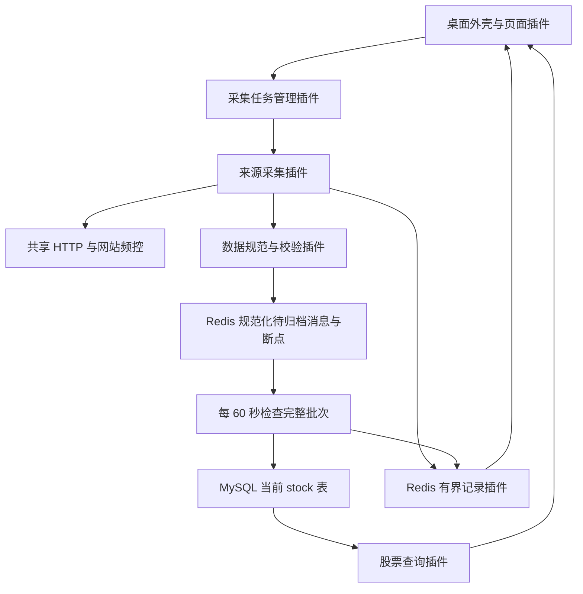

# Empire 架构设计

本文描述当前实现和已确认的存储简化方案。当前业务为新浪沪深北股票列表、新浪 7×24 财经新闻和巨潮 A 股交易日历；公告、历史行情、选股和回测尚未接入。

## 1. 需求基线与设计假设

| 项目 | 约束 |
| --- | --- |
| 使用方式 | 个人使用，本地 Windows，Python / PySide6 桌面 |
| 研究范围 | A 股投资研究与决策辅助；暂不接入券商和实盘自动下单 |
| 插件 | 全部业务能力由内部插件提供，运行时可启停，不开放第三方加载 |
| 发布方式 | 整个应用统一发布；代码更新后重启，运行时启停不等于代码热更新 |
| 数据服务 | 直接连接本机或已有 Redis / MySQL，不使用 Docker Desktop 或 WSL2 |
| 数据库变更 | 应用升级不自动迁移、重建或搬运数据；按实际需求显式执行针对性 SQL并记录变更 |
| 业务数据路径 | 来源响应经过校验和规范化后先入 Redis，每 60 秒尝试归档；MySQL 提交后删除对应队列消息 |
| 数据保留 | MySQL 保存当前股票表 stock、历史新闻表 finance_news、交易日历表 trade_calendar；成功请求原文不持久保存，不积累历史完整股票列表 |
| 故障记录 | 采集记录每项目 100 条、归档记录每项目 100 条、错误记录每项目 300 条，都只留 Redis，不归档 |
| 频率管理 | 执行计划与 HTTP 请求间隔分开；同域名组共享间隔、并发及服务器冷却 |

应用关闭后停止采集。Windows 当前用户只允许一个 Empire 实例，不因使用不同配置文件绕开单实例保护。按用户最新要求，Redis 关闭 AOF 和自动快照，断点与控制数据只留内存；Redis 服务或电脑重启会丢失未归档数据及控制状态。只重启应用可续跑。服务全局配置只在明确维护时修改，应用启动不修改。

## 2. 总体结构

采用单体桌面应用、插件内核和持久化数据管道，不引入微服务、插件沙箱或外部调度平台。

界面只通过能力接口查询和操作后台，SQL、网络和 Redis 操作不在 Qt 主线程执行。异步后台负责采集、计划和归档；MySQL 工作在专用执行器中。

## 3. 插件内核与能力边界

内核只处理插件清单、依赖顺序、能力注册、状态和任务资源回收，不解释股票字段或网站规则。插件声明 `requires` / `provides`，由内部白名单注册；不存在动态扫描第三方目录。

| 插件能力 | 职责 |
| --- | --- |
| `redis.store` / `mysql.store` | 连接、能力检查与受控存储操作 |
| `http.fetch` | 请求、重试、重定向、域名组许可及冷却 |
| `ingest.publish` | 规范化消息与游标的原子入队、容量背压 |
| `archive.worker` | 恢复队列，验证完整批次，提交 MySQL 后确认和删除 |
| 数据规范插件 | 规范字段、身份校验与业务持久化映射 |
| 来源采集插件 | 解析来源、分页、边界校验、断点恢复；不直接写 MySQL |
| `collection.control` | 任务计划、参数、执行互斥、暂停和采集记录 |
| `collection.records` | 独立归档记录与错误样本，按项目限量保存及精确删除 |
| `stocks.query` | 读取当前股票列表、筛选、分页与当前发布状态 |
| `ui.pages` | 按统一契约贡献页面和导航分组 |

插件启动只提供能力；任务执行由统一管理器决定。停止有依赖的插件时显式处理依赖关系，并等待其拥有的协程和连接退出。UI 插件通过 `PageContribution` 声明页面，不把导航或业务按钮写死在内核。

## 4. 股票数据与存储

股票功能仅需 `stock` 表，主键为 `(source, unified_code)`。字段为 `source`、`node`、`unified_code`、`code`、`name`、`market`、`source_symbol`、`generation`、`started_at`、`updated_at`。字段说明见桌面“系统管理 → 说明文档”。

`generation` 是当前列表的发布身份，用于识别重复或旧消息，不表示保留多份历史快照。六位代码按字符串保存；统一代码为 `000001.SZ`、`600519.SH`、`920000.BJ`。市场来自已验证的来源标识，不靠数字范围猜测。

新批次的开始、规范化股票分页和完成证据暂留 Redis 同一入队 Stream，不另建重复暂存表。归档器取得完整证据后，在一个 MySQL 事务内替换对应来源和节点的当前列表。事务失败或批次不完整时旧列表继续可见。成功请求的完整 HTTP 原文只用于当前解析，不进入 Redis 业务队列或 MySQL。

股票列表是当前基础数据，不是历史任意时点股票池。未来历史行情等数据集应单独确定保留规则，不能直接套用当前列表的覆盖规则。

## 5. 三类记录与错误处理

| 数据 | 所在位置 | 上限与规则 |
| --- | --- | --- |
| 采集记录 | Redis 控制数据 | 每个项目最近 100 条，记录执行状态、时间与结果摘要 |
| 归档记录 | Redis 独立 LIST | 每个项目最近 100 条，记录批次归档结果 |
| 错误记录 | Redis 独立 LIST | 每个项目最近 300 条；错误原文样本每条最多 64 KiB |

三类记录都不进入业务归档队列，不写入 MySQL。错误记录包括发生时间、阶段、原因、请求地址、状态码、元数据、脱敏原文样本、截断标记、原始字节数和 SHA-256。超过样本上限时不保留完整大响应，只保留截断样本及摘要。请求地址、正文和元数据中的凭据需脱敏后保存和展示。

错误不会因为打开页面或后续采集成功而自动清除。先修复并验证问题，再在运行记录的错误页选择具体记录、确认已完成修复验证，调用 `clear_errors(project_id, record_ids)`。删除范围为确定的项目和记录 ID，期间产生的新错误继续保留；禁止按整个项目清空代替精确清除。容量超过 300 条时按有界保留规则淘汰最旧项。

## 6. 数据管道归档与断点恢复

1. 来源插件取得响应并完成字段、顺序和页边界校验，生成规范化消息。
2. Redis Lua 以游标版本 CAS 校验并一次提交整页消息与下一页游标，先入队后推进断点，不产生漏页窗口。
3. 每 60 秒归档器检查待处理数据；启动时先恢复遗留工作。未取得完成证据的整批数据仍留 Redis，不发布不完整列表。
4. 完整证据验证数量、页连续性、唯一身份及首尾一致性，在一个 MySQL 事务中发布当前股票列表。
5. MySQL 成功提交后才执行 Redis `XACK` 和 `XDEL`。如果进程在提交与确认间退出，重复投递通过当前发布身份验证处理，不重复累积业务数据。
6. 必要断点、当前发布结果和有界记录留在 Redis，支持重启继续。进程退出不能清空未归档队列。

MySQL 写入失败时保留规范化待归档消息，并在 Redis 留下归档失败记录；不会把有效业务数据复制成错误原文样本。错误样本针对 HTTP、解析、来源校验或结构不兼容等问题，不能把错误原文或失败消息写进 SQL 隔离表。无效消息不得成为当前业务数据，其诊断样本也只留 Redis。当前没有 MySQL 原始事件表、分页证据表或隔离表。

背压检查本应用队列条数、单页字节和共享 Redis 内存水位。达到上限时暂停采集而非裁剪未归档业务消息。由于完整股票批次需要先留 Redis，容量配置须容纳一次完整批次；无法容纳时应调整项目容量或源分页方案，不能靠丢消息解除阻塞。

## 7. 跨插件共享采集频控

`sina.com.cn` 与其所有子域名属于同一 `sina` 组，股票和新浪新闻共用许可。每个请求，包括重试和重定向，都先通过组频控。Redis 保存组下一次许可时间与 429 冷却截止时间，使用 Redis 时间避免本机时钟漂移；并发槽在当前单实例进程内管理。

任务计划决定何时启动采集；网站间隔决定采集过程中 HTTP 请求的速度。网站间隔在界面保存后作用于后续许可申请，既有冷却不因改设置被清除。域名归属和并发上限由内部配置声明，重启后生效。

## 8. 桌面与统一管理

十个页面按工作台、数据中心、采集管理和系统管理组织。运行记录页使用采集、归档、错误三个标签，不为记录类型增加新的侧栏入口。

执行计划支持手动、固定间隔和北京时间每日定时；同一任务不重叠。正常暂停同时禁用后续计划并保留断点；恢复前启用并保存。错过的计划只补执行一次，不堆积历史周期。计划草稿与已保存配置分开，刷新不覆盖输入。

详见 [桌面使用说明](desktop-guide.md) 和 [统一采集管理](collection-management.md)。

## 9. 数据库变更和发布

应用正常启动只验证连接与需要的表结构，不自动 DDL。`init-db` 是显式创建缺失业务表的命令；不是应用升级步骤，不执行旧表清理或数据搬运。

从旧结构改为单表时，先核验并保留当前完整股票数据，再执行本次已确认的针对性 SQL，最后核验数量与关键字段。相关 SQL 与实际执行记录由 `sql/changes` 管理，不由启动过程自动重放。共享 Redis 的其他项目、数据库服务和持久化目录不在清理范围。

## 10. 后续范围与验证

下一数据渠道通过来源插件、规范映射和统一管理任务定义接入；新闻不等于上市公司公告，巨潮交易提示也不能直接代表完整历史交易日历。选股与回测前还需行情、复权因子和历史上市状态等可靠输入。

所有数据插件必须按业务唯一键比较规范化内容及来源版本，完全相同则跳过业务 DML，不仅为了刷新观测时间执行写库。新闻每页批量读取比较后，仅提交新增或有效变更；股票完整列表相同则不替换，最新核验批次用 Redis stocks:committed 保存。来源版本变更即使正文相同也需要保留，以阻止旧版覆盖。测试必须验证重复采集无业务写入、修订、旧响应和重放。

关键验证包括：分页中断续采；不完整批次不覆盖当前表；提交后确认前故障恢复；旧消息重放；保存失败回滚；跨插件频控；三类记录按项目独立限量；错误样本脱敏和截断；精确清除时保留新到错误；桌面异步查询与草稿保护。测试使用专属命名空间和来源，只清理测试拥有的数据。

## 新浪财经新闻扩展

新闻页通过 news.query 能力读取 finance_news 表。news.flash.page 是独立可归档页面，archive.worker 通过数据契约映射执行追加/修订写入；不依赖股票完整批次，也不会清理历史新闻。按来源 ID 的分页与增量断点实现见 [新浪新闻](sina-news.md)。SQL 提交后更新 Redis archive:progress:<job_key> 并删除消息；旧重放不会倒退最新归档进度。

## 巨潮交易日历扩展

calendar.query 读取 trade_calendar 并按 SQL 日期完整性生成历史补采计划；collector.cninfo_calendar 请求历史缺月及本月至下一年 12 月。calendar.month 是整月完整日历，复用独立页面归档路径，未变日期无业务 DML。因来源无修订版本，契约提供 month 作为观测分区，归档器在 Redis archive:observed:<dataset>:<source> 保存每月最新成功观测，阻止旧响应倒退。界面只读取 calendar.query，来源请求走 cninfo.com.cn 共享频控。详见 [巨潮日历](cninfo-calendar.md)。
